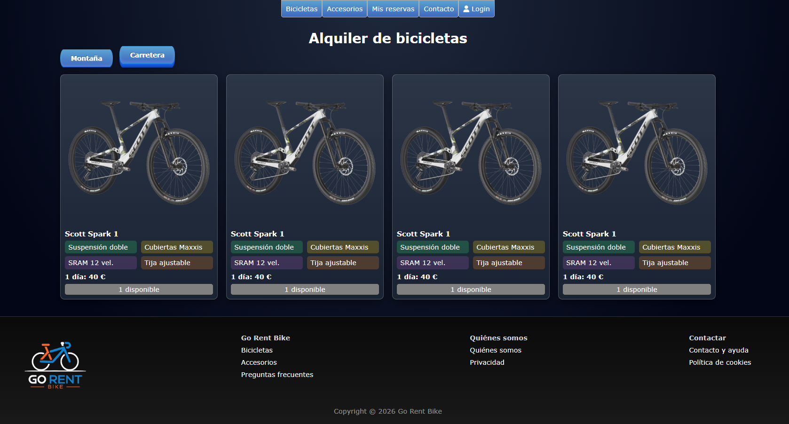
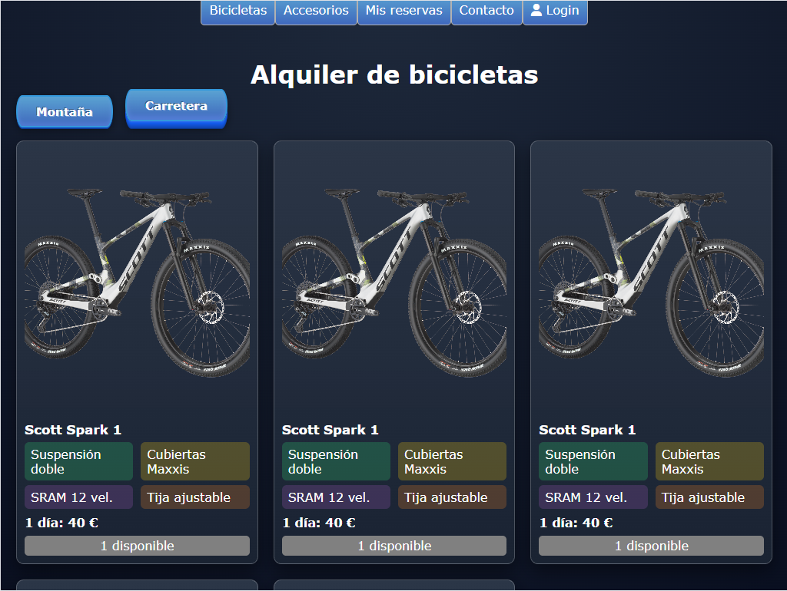

# Uso

## Descripción general
La aplicación muestra un catálogo de bicicletas disponibles para alquiler, incluyendo sus características principales y precio por día.

## Secciones principales
- Barra de navegación
- Filtros por tipo de bicicleta
- Listado de bicicletas
- Pie de página con enlaces informativos

## Capturas de pantalla

Versión de escritorio:

Versión tablet:

Versión móvil:

## Casos de uso
- Consultar bicicletas disponibles
- Visualizar características técnicas
- Comprobar disponibilidad
- Navegar desde dispositivos móviles

## Usuarios tipo
- Clientes interesados en alquilar bicicletas
- Usuarios que consultan precios y modelos

[⬅ Volver al índice](index.md)

